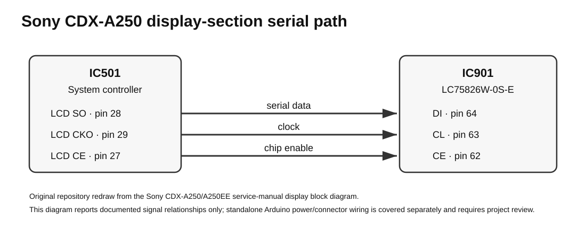

# Sony CDX-A250 LCD Panel — LC75826 + Arduino

Reverse-engineering notes, reference firmware, and reproduction guidance for driving the **Sony CDX-A250** detachable front-panel LCD with an Arduino through its **LC75826W** LCD driver.

[Watch the full project video on YouTube](https://youtu.be/Oe9wPHL-y7k)



## What this project does

The Sony CDX-A250 front panel contains an LC75826W LCD driver (IC901 in the Sony service documentation). This repository shows how the panel was driven independently of the original head unit and documents the parts of the LC75826 interface needed to understand and reproduce the experiment.

The supplied Arduino sketch demonstrates:

- direct CE / CL / DI communication with the LC75826;
- all-segments on/off tests;
- fixed display patterns including `HI FOLKS`, `SONY`, and `CDX-A250`;
- an interactive segment-identification routine;
- practical use of the LC75826 display-data groups and control fields.

The repository is intentionally focused on the **working project shown in the video**. It is not a generic LC75826 library.

## Hardware used

- Sony CDX-A250 detachable front panel
- LC75826W LCD driver on the panel
- Arduino-compatible board using Uno-style pin numbering in the reference sketch
- bench power for the panel
- pushbutton for the segment-identification routine
- wiring/protection components used in the demonstrated setup

The service manual identifies the relevant panel connector as **CN901** and the LCD driver as **IC901 — LC75826W-0S-E**.

## Quick start

### 1. Read the connection notes

Start with [`docs/connections.md`](docs/connections.md). The project uses the panel serial interface exposed through CN901:

| Function | Sony CN901 | Arduino sketch |
| --- | ---: | ---: |
| DATA-LCD → LC75826 DI | 11 | D8 |
| CE-LCD → LC75826 CE | 12 | D10 |
| CLOCK-LCD → LC75826 CL | 13 | D9 |
| +B panel supply | 14 | external bench supply |
| Ground | panel ground rail | common with Arduino |

The panel is powered as a Sony front-panel assembly; do **not** bypass the panel circuitry and feed the LC75826 VDD pin directly unless you are deliberately designing a different setup.

### 2. Open the Arduino sketch

Use:

[`arduino/LC75826_Sony_CDX_A250_panel_Car_Radio_V2.ino`](arduino/LC75826_Sony_CDX_A250_panel_Car_Radio_V2.ino)

The original source is preserved as the reference implementation used for this project. It is intentionally not rewritten into a library because the goal is to keep the demonstrated behavior traceable.

The main pin definitions are:

```cpp
#define VFD_in  8
#define VFD_clk 9
#define VFD_ce  10
#define BUTTON_PIN 2
#define addr 0x41
```

The historical `VFD_` variable names are kept unchanged even though this Sony panel uses an LCD.

### 3. Upload and observe

The sketch uses the serial monitor at **115200 baud** for debug and segment-identification output.

The main demo sequence exercises:

- `allOFF()`
- `allON()`
- `msgHiFolks()`
- `msgSONY()`
- `msgCDX()`
- `searchOfSegments()`

## LC75826 communication in this project

The LC75826 uses SANYO's CCB serial format. The project uses the documented device address:

```text
41H
```

Each transfer starts with the address and then sends one of four 72-bit groups. The two DD bits identify the group:

| DD | Display-data range |
| --- | --- |
| `00` | D1–D52 |
| `01` | D53–D104 |
| `10` | D105–D152 |
| `11` | D153–D208 |

The first group also carries the control fields that configure the driver, including:

- P0–P3: segment-output / general-purpose-output selection
- DR: LCD bias selection
- DN: 200/208-segment selection
- FC0–FC2: frame-frequency control
- OC: internal/external oscillator mode
- SC: display on/off
- BU: normal/power-saving mode

The reference source shifts each byte **least-significant bit first**.

For the detailed transfer layout and the exact relationship to the sketch, see [`docs/protocol.md`](docs/protocol.md).

## Why segment mapping is necessary

The LC75826 datasheet defines the electrical correspondence between D1…D208 and the driver's segment/common matrix. It cannot tell us which visible symbol Sony connected to each matrix position on the custom LCD glass.

That mapping must be discovered experimentally.

The included `searchOfSegments()` routine advances through test states one at a time. A pushbutton on D2 advances the test while the serial monitor prints enough information to identify the current state.

The recommended workflow is documented in [`docs/segment-mapping.md`](docs/segment-mapping.md).

## Repository structure

```text
.
├── README.md
├── LICENSE
├── ASSET_LICENSE.md
├── THIRD_PARTY_NOTICES.md
├── arduino/
│   └── LC75826_Sony_CDX_A250_panel_Car_Radio_V2.ino
└── docs/
    ├── connections.md
    ├── protocol.md
    ├── segment-mapping.md
    ├── troubleshooting.md
    ├── references.md
    ├── licensing.md
    └── assets/
        ├── lc75826-data-groups.svg
        └── sony-display-interface.svg
```

## Technical documentation

- [Connections and bench setup](docs/connections.md)
- [LC75826 protocol notes](docs/protocol.md)
- [Segment-identification workflow](docs/segment-mapping.md)
- [Troubleshooting](docs/troubleshooting.md)
- [Primary references and provenance](docs/references.md)
- [Licensing and attribution](docs/licensing.md)

## Primary references

The technical work is based on:

- **SANYO LC75826E / LC75826W — 1/4-Duty General-Purpose LCD Display Driver**
- **Sony CDX-A250 / CDX-A250EE Service Manual**, Ver. 1.1, 2006-01, publication 9-879-865-02
- the original project hardware, firmware, photographs, and measurements used in the video

The manufacturer PDFs are **not redistributed here**. See [`docs/references.md`](docs/references.md) for source identification and links.

## Troubleshooting priorities

If the display does not respond, check the problem in layers:

1. panel power and common ground;
2. CE / CL / DI continuity;
3. presence of address `0x41`;
4. correct DD group transmission;
5. INH / SC / BU state;
6. segment data and mapping.

Do not start by changing character-pattern bytes when the failure may be in power or serial transport.

## License

The project is intentionally permissive:

- **code:** MIT License;
- **original documentation, diagrams, and project photographs:** CC BY 4.0;
- **manufacturer/service documents, logos, trademarks, and other third-party material:** remain the property of their respective owners and are not relicensed here.

See [`docs/licensing.md`](docs/licensing.md) and [`THIRD_PARTY_NOTICES.md`](THIRD_PARTY_NOTICES.md).

## Video

The complete walkthrough and hardware demonstration are available here:

**https://youtu.be/Oe9wPHL-y7k**
