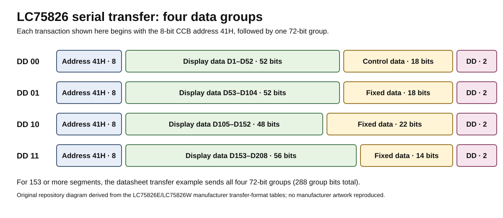

# LC75826 protocol notes used by this project

This page extracts the part of the LC75826 interface needed to understand the supplied Sony CDX-A250 Arduino sketch. It is not a replacement for the manufacturer datasheet.

## CCB address

The LC75826 CCB address used by the project is:

```text
41H
```

and the source defines:

```cpp
#define addr 0x41
```

## Serial signals

The transfer uses three LC75826 inputs:

- **CE** — chip enable
- **CL** — synchronization clock
- **DI** — serial data

The Sony service documentation shows the original system controller driving the same LCD CE, clock, and serial-data paths toward IC901.

## Transfer organization

After the 8-bit CCB address, the LC75826 receives a 72-bit group. The final two bits, **DD**, identify which part of the display-data space is being written.

| DD | Display data carried | Additional fields |
| --- | --- | --- |
| `00` | D1–D52 | control data + DD |
| `01` | D53–D104 | fixed positions + DD |
| `10` | D105–D152 | fixed positions + DD |
| `11` | D153–D208 | fixed positions + DD |



For a panel using data above D152, all four groups are required.

## Control fields

The first transfer group carries the main operating controls.

### P0–P3 — segment/GPIO selection

S1/P1 through S8/P8 can operate as LCD segment outputs or general-purpose outputs. The P0–P3 combination selects how many of these pins are converted to P1–P8.

### DR — LCD bias

| DR | Drive scheme |
| --- | --- |
| `0` | 1/3 bias |
| `1` | 1/2 bias |

### DN — 200/208-segment selection

| DN | Mode |
| --- | --- |
| `0` | up to 200 display segments |
| `1` | up to 208 display segments |

In 208-segment mode, S51 and S52/OSCI are available as segment outputs under the documented oscillator conditions.

### FC0–FC2 — frame frequency

These bits select the LCD common/segment waveform frame frequency from the ratios defined in the datasheet.

### OC — oscillator mode

| OC | Mode |
| --- | --- |
| `0` | internal oscillator |
| `1` | external clock |

### SC — display enable

| SC | Display |
| --- | --- |
| `0` | on |
| `1` | off |

### BU — power mode

| BU | Mode |
| --- | --- |
| `0` | normal |
| `1` | power saving |

## D1–D208 and the LCD matrix

The LC75826 does not receive characters. It receives individual display-data bits.

Each segment output has one data bit for each of the four common outputs. Examples:

| Segment output | COM1 | COM2 | COM3 | COM4 |
| --- | ---: | ---: | ---: | ---: |
| S1/P1 | D1 | D2 | D3 | D4 |
| S13 | D49 | D50 | D51 | D52 |
| S14 | D53 | D54 | D55 | D56 |
| S26 | D101 | D102 | D103 | D104 |
| S27 | D105 | D106 | D107 | D108 |
| S38 | D149 | D150 | D151 | D152 |
| S39 | D153 | D154 | D155 | D156 |
| S50 | D197 | D198 | D199 | D200 |
| S51 | D201 | D202 | D203 | D204 |
| S52/OSCI | D205 | D206 | D207 | D208 |

The custom Sony LCD determines which visible icon or stroke is connected to each matrix position. That is why physical segment mapping is required.

## What the reference sketch does

### Bit order

`send_char_without()` starts with mask `0b00000001` and shifts the mask left. Each byte is therefore transmitted **LSB first**.

### Address phase

`send_addr()`:

1. drives CE low;
2. shifts out `0x41`;
3. raises CE after the address.

The following bytes are then shifted before CE is returned low at the end of the selected group.

### Group-ending values used by the sketch

The reference code uses these final-byte patterns when selecting the four groups:

```cpp
0B00000000  // DD 00
0B10000000  // DD 01 in the sketch's LSB-first representation
0B01000000  // DD 10
0B11000000  // DD 11
```

Because the source transmits LSB first, do not infer wire order by reading the C++ binary literal left-to-right.

## Why the original source is preserved

The sketch is deliberately straightforward and repetitive. That is useful here: each display pattern can be traced directly to the data sent to the driver.

A future library could abstract packets, control fields, fonts, or segment tables, but that should be treated as a separate implementation and tested against the hardware. The repository keeps the demonstrated sketch as the reference baseline.
